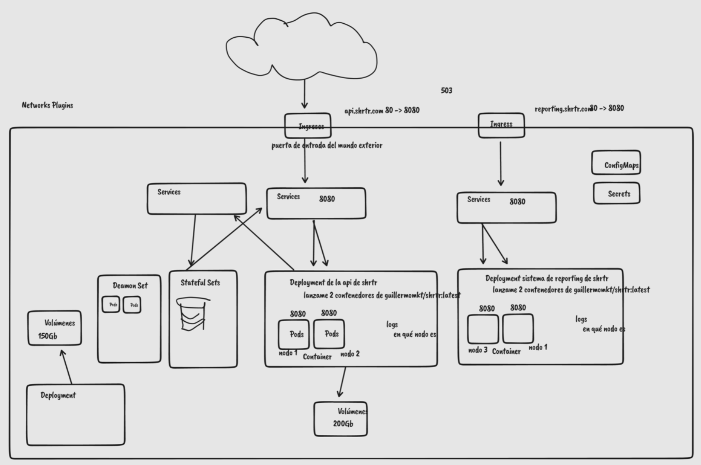

# KUBERNETES

## Steps
1. Create a folder: infra, then create a folder "cluster"
    1. config.yml. This is for Kind, to get a local cluster, but the config.yaml is the same deployed on kubernetes. 
   ```yaml
    kind: Cluster #type 
    apiVersion: kind.x-k8s.io/v1alpha4
    nodes:
   - role: control-plane #node type
     kubeadmConfigPatches:
      - |
        kind: InitConfiguration
        nodeRegistration:
          kubeletExtraArgs:
            node-labels: "ingress-ready=true"
     extraPortMappings:  #map the container port to localhost
       - containerPort: 80
         hostPort: 80
         protocol: TCP
       - containerPort: 443
         hostPort: 443
         protocol: TCP
   
    #Commands on Kind
    #kind create cluster --config=config.yaml --name=monolith-system
    #We need an ingress
    #kubectl apply -f https://raw.githubusercontent.com/kubernetes/ingress-nginx/master/deploy/static/provider/kind/deploy.yaml
   ```
2. Create folder inside infra, of applications, all the pods that we want.
To create an app:
   1. Deployment.yml
   ```yaml
   apiVersion: apps/v1
   kind: Deployment  #see the image to see the types
   metadata:
    labels:
     component: monolith-deployment # name of component and the label
     name: monolith-deployment # name of component
   spec:  # specifications of the deployment
     replicas: 1  #how many pods I want
     selector:  # how to select the deployment component
       matchLabels:
         component: monolith-deployment  # name of component
     strategy: # strategy of deployment for some changes
       rollingUpdate:  #the method to avoid downtimes
         maxSurge: 1
         maxUnavailable: 0
     type: RollingUpdate
   template:  # pods inside the deployment
     metadata:
       labels:
         component: monolith-deployment
     spec:
       containers:
        - name: monolith-container
          env:
          - name: SPRING_DATASOURCE_URL
            value: 'jdbc:mariadb://mariadb-service.default.svc.cluster.local:3306/shrtdb'
          image: hacheev/monolith_systems_monolith:latest
          ports:
            - containerPort: 8080
              protocol: TCP
          resources:
            limits:
              memory: 500Mi
            requests:
              cpu: 200m
        dnsPolicy: ClusterFirst
        restartPolicy: Always
        terminationGracePeriodSeconds: 30
   ```
3. Create the service to connect the deployment:
   ```yaml
   apiVersion: v1
   kind: Service  # type of kind component inside the cluster
   metadata:
     name: monolith-service  # name of the service
   spec:
     selector:
        component: monolith-deployment # where deployemnt show
     ports:  #expose the ports and select the port to point
     - port: 8080
       protocol: TCP
       targetPort: 8080
     type: ClusterIP  # is better always cluster ip
   
      ```
4. Create and ingress, necessary to show the app outside the cluster and get the capability to give requests:
   ```yaml
   apiVersion: networking.k8s.io/v1
   kind: Ingress  # type in kind
   metadata:
     name: monolith-ingress  #name of the ingress
   spec:
     rules:
       - http:  #request protocol
           paths:
            - pathType: Prefix
              path: "/"
              backend:
                service:
                  name: monolith-service  # which service to point
                  port:
                    number: 8080  #port of the ingress
   ```
5. Kubernetes commands
   ```yaml
    # Apply configuration  
    kubectl apply -f kafka (directory or file)
    # Get deployments  
    kubectl get deployments
    # Restart deployments
    kubectl rollout restart deployment <deployment-name>
    # Get pods  
    kubectl get pods
    # Get pod logs 
    kubectl logs <pod name>
   kubectl delete deployment kafka-deployment
   ```